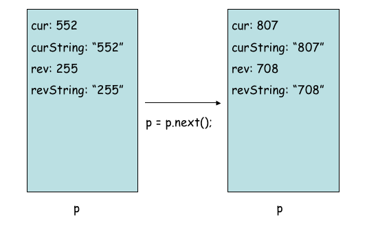

# Programming Project: Numerical Palindromes

For this assignment your job is to create a two class application that examines the concept of a numerical palindrome.

## Clone Project

Begin by cloning the provided project and importing it into your workspace.

`git clone <url for github repository>`

After cloning this repository you want to run these commands

`git checkout -b development`

This will create a branch named development and switch you to it. The development branch is where you will make all your commits.

## Import into Eclipse

You should then go to Eclipse, which hopefully has finished installing.

In the top toolbar, click File --> Import. Double-click on General and then `Projects from Folder or Archive`. Click `Directory` and find the folder inside the repository named `NumericalPalindromes` and click Open. The project should pop up in the text box Projects. Click finish and you should be good to go!

## Complete Numerical Palindromes Assignment

A numerical palindrome is a non-negative whole number that is the same forwards and backwards, e.g. 2332, 12321, etc. Here's the catch: suppose you do the following. Start with any positive whole number. If it's a palindrome, you're done; if it isn't, reverse the number, add the reversal to the original value, and test this new result. It it's a palindrome, you're done; otherwise repeat: reverse, add, and test again, and so forth. This process almost always leads, very quickly, to a palindrome.

Example:

- 152 (no)
- 152 + 251 = 403 (no)
- 403 + 304 = 707 (yes)

Example:

- 552 (no)
- 552 + 255 = 807 (no)
- 807 + 708 = 1515 (no)
- 1515 + 5151 = 6666 (yes)

Your job is to code this process, using the JOptionPane class to accept an initial (String) input value.

Here is sample output for 552.

```
start value [552]
552 reverse-> 255  [output of toString method]
new sum: 552 + 255 = 807
807 reverse-> 708  [output of toString method]
new sum: 807 + 708 = 1515
1515 reverse-> 5151 [output of toString method]
new sum: 1515 + 5151 = 6666
final value: 6666
number of steps: 3
```

To help you code the solution, we've provided the driver class below, which you MAY NOT alter. Your job here is to code the NumPal class.

```java
import javax.swing.JOptionPane;
public class NumPalDriver {

  public static void main(String[] args){
    String start = JOptionPane.showInputDialog("Enter a number: ");
    System.out.println("start value ["+ start + "]");
    NumPal numPal = new NumPal(start);
    int ctr = 0;
    while (!numPal.isPalindrome() && (ctr < 10)){
      System.out.println(numPal.toString());
      System.out.print("new sum: ");
      System.out.println(numPal.getCur()+" + "+numPal.getRev()+ " = " +
                         (numPal.getCur()+numPal.getRev() ));
      p = numPal.next();
      ctr++;
    }
    System.out.println("final value: " + numPal.getCur());
    System.out.println("number of steps: " + ctr);
  }
}
```

Here is a sample output with 997 as the input:

```
start value [997]
997 reverse-> 799
new sum: 997 + 799 = 1796
1796 reverse-> 6971
new sum: 1796 + 6971 = 8767
8767 reverse-> 7678
new sum: 8767 + 7678 = 16445
16445 reverse-> 54461
new sum: 16445 + 54461 = 70906
70906 reverse-> 60907
new sum: 70906 + 60907 = 131813
131813 reverse-> 318131
new sum: 131813 + 318131 = 449944
final value: 449944
number of steps: 6
```

As we indicated above, this process doesn't always work. For example, 196 seems to go on and on. Thus it's necessary to cap the number of iterations. Here we've capped them at 10. Also, because numbers may grow large, you will need to use the whole number type long rather than int. Thus you will need to use the method `Long.parseLong` from the Long wrapper class, instead of `Integer.parseInt`, to convert a string of digits into an actual number.

Make sure you have a thorough pencil and paper understanding of the problem before you even begin to think about coding.

### Structuring your Solition

A note on how to structure your solution. A NumPal object MUST have four attributes: the current number, its reverse, the String version of the current number, and String version of the reverse of the current number. The numbers should be of type long, not int.

#### How does a solution evolve?

The driver code generates a sequence of distinct objects that represent successive constructions of new NumPal objects. The next() method in NumPal is the key. It generates a new NumPal object from an old one, and your coding of this method is the key activity of the assignment. Generating the next numerical value from the current value is easy: you're just adding the current value and the value of its reverse from the current object. It's the other three object attributes for the next NumPal object that require some thought. Notice, by the way, that while each successive NumPal object is distinct, the variable reference in each case is the same: `numPal`.

The diagram below illustrates the first two steps of NumPal object evolution for one of the examples above. An important observation: while it's not obvious how to generate the reverse of a number directly, it's relatively easy to 1) turn a number into a String; 2) reverse a String; and 3) turn a String into a number.



Here's a detailed account of what you need to do for this assignment. You must develop a complete class, NumPal, which works properly with the driver class above, and in that way allows you to turn integer inputs into numerical palindromes.

Your submitted code must implement the following methods:

- Implement the NumPal constructor. Notice that it takes a String argument, NOT an integer argument.

- Implement the isPalindrome() method, which determines if a NumPal object represents a palindrome.

- Implement the toString() method, which returns a String of the proper form (an example of toString output is given in the first sample run above for 552).

- Implement the next() method, which - given a NumPal object - returns the next NumPal object according to the "reverse and add" method described above.

- Implement a reverseString method, which takes a String, say s, as an argument, and returns the reverse of s. Thus reverseString("aabcd") should return the String dcbaa. The code you submit should use this method in an essential way. This method appears as an exercise at the end of Chapter 5 in the textbook.

One final comment. There are clearly many ways to structure a solution to this problem. We've chosen one, and you need to adhere to the pattern we've spelled out above. You may not alter the driver class in any way.

## Notes

- You need to comment your methods according to this [Javadoc Guide](https://github.com/jd12/liferay-portal/blob/master/readme/ADVANCED_JAVADOC_GUIDELINES.markdown).
